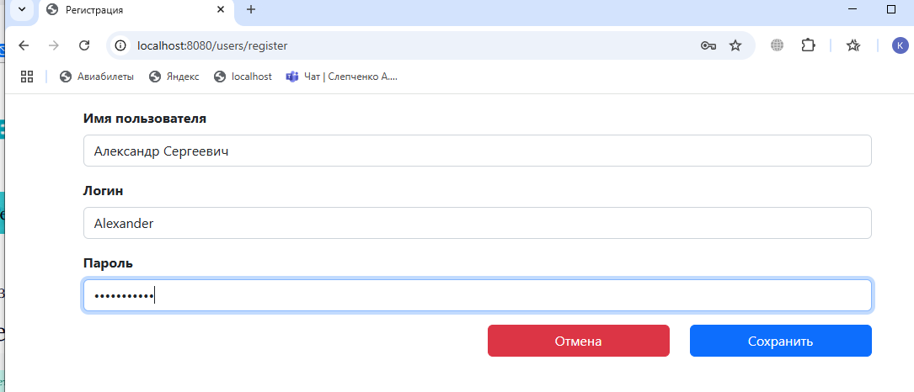
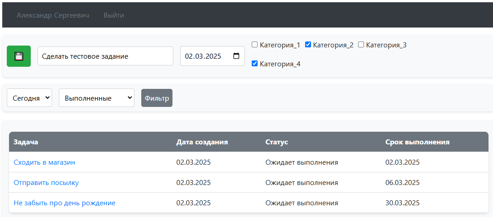
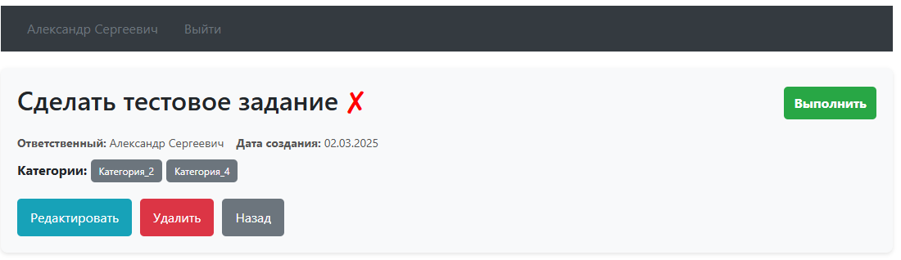
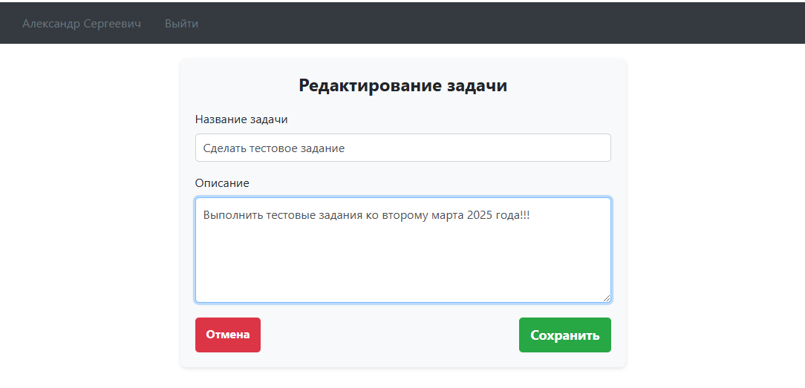
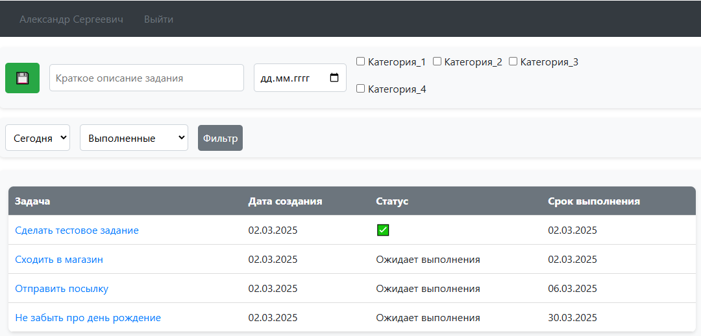
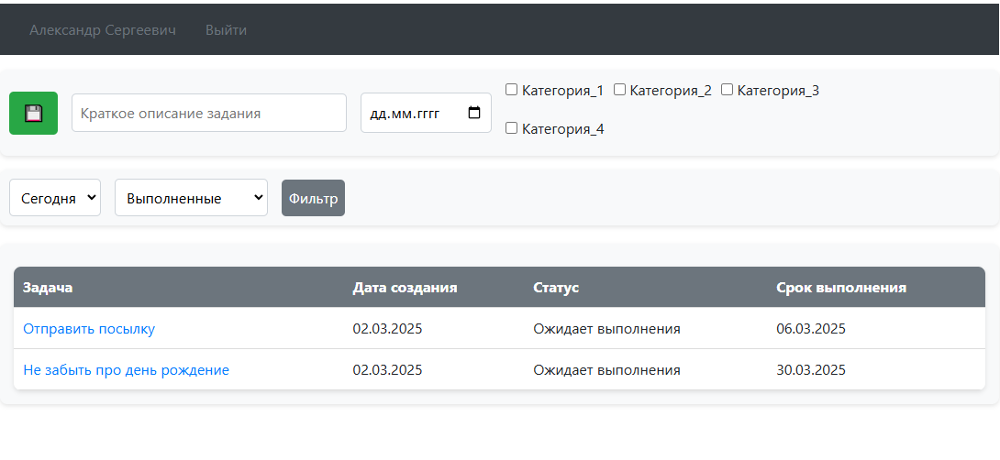

# Проект "Документооборот"

Тестовое задание

## Описание приложения

Приложение Todo-list для создания задач. Пользователь может зарегистрироваться, создавать задачи, редактировать, 
менять статус выполнения, дополнять подробной информацией, фильтровать, удалять.

## Содержание

- [Описание приложения](#описание)
- [Особенности](#особенности)
- [Технологии](#технологии)
- [Использование](#использование)
- [Интерфейс(Скриншоты)](#Интерфейс (Скриншоты))

## Особенности

- Для работы с приложением, пользователь должен пройти регистрацию и авторизацию.
- На главной странице есть возможность быстрого создания задачи дав ей краткое описание. Так же можно выставить дату окончания, категории и сделать подробное описание на странице редактирования
- Есть возможность менять статус выполнения задачи
- Есть меню для фильтрации задач, где можно выставить фильтры "выполненные", "не выполненные", "сегодня", "неделя", "месяц"

## Технологии

- **Java 17**
- **Spring Boot 2.7.6**
- **Spring Web**
- **Thymeleaf**
- **PostgreSQL 42.5.4**
- **Hibernate 5.6.11**
- **Maven**
- **Lombok**

### Предварительные требования
- Установленный [Java 17](https://adoptium.net/)
- Установленный [Maven](https://maven.apache.org/)

### Сборка и запуск проекта

1. **Клонируйте репозиторий**:
   ```bash
   https://github.com/Slepchenko/TodoList.git

2. ** Соберите проект с помощью Maven:
   ```bash
    mvn clean install

## Использование

Загружать приложение необходимо в браузере используя http://localhost:8080/

## Интерфейс (Скриншоты)

При старте нужно зарегистрироваться. Для этого нужно заполнить форму. 


После авторизации мы попадаем в меню. В верхней части страницы кратко описывается задача. Выбирается дата завершения,
категория и после нажатия на зеленую кнопку, задача сохраняется и появляется в списке ниже. 


После создания задачи, можно перейти на ее страницу для редактирования. На странице присутствует информация:
Имя пользователя, выбранные категории, дата создания. 


Если нажать на кнопку "Редактировать" можно изменить её краткое описание, а также дополнить подробной информацией


После выполнения задания, можно поставить отметку о выполнении нажав на кнопку "Выполнить". Тогда в главном списке
задача поменяет свой статус. Если выяснится, что задача еще не выполнена или смена статуса была произведена
ошибочно, можно статус изменить на странице задачи.


Если задач скопилось большое количество, можно выставить фильтры для сужения поиска.
